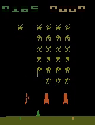

<div align="center">

# SpaceInvaders-DQN
*Deep Reinforcement Learning from raw Atari pixels (Gymnasium + PyTorch)*

[](#)
[](#)
[](#)

</div>

## 🕹️ Hero


> Replace the placeholder above with your favorite .gif or screenshot of the trained agent.

## 🚀 Overview
- DQN agent that learns Space Invaders directly from pixels using Gymnasium (`ALE/SpaceInvaders-v5`).
- Built with PyTorch, NumPy, Matplotlib, and Gymnasium wrappers for frame stacking and resizing.
- Training-ready logging via TensorBoard (`runs/space_invaders_dqn`) and Weights & Biases (`space-invaders-dqn`).
- Video capture every N episodes (default: 250) for qualitative evaluation.

## 🧠 Architecture Deep Dive
| Stage | Details |
| --- | --- |
| Input preprocessing | Grayscale observations resized to 84x84; stack last 4 frames for temporal context. |
| Conv 1 | 16 filters, 8x8 kernel, stride 4, ReLU. |
| Conv 2 | 32 filters, 4x4 kernel, stride 2, ReLU. |
| Conv 3 | 64 filters, 2x2 kernel, stride 1, ReLU. |
| Conv 4 | 128 filters, 2x2 kernel, stride 1, ReLU; flatten. |
| Fully Connected | Linear 1024 -> ReLU -> Linear |A| (one Q-value per action). |
| Stability tricks | Target network (synced every 7k env steps), replay buffer, epsilon-greedy exploration. |

## 🔧 Key Hyperparameters
| Parameter | Value | Notes |
| --- | --- | --- |
| Learning rate (α) | 2e-4 | Adam optimizer on policy network. |
| Discount factor (γ) | 0.95 | Future reward weighting. |
| Epsilon schedule | start 1.0 -> decay 2e-5 -> floor 0.10 | Linear decay across ~50k episodes. |
| Batch size | 120 | Sampled from replay buffer. |
| Replay buffer | 1,000,000 transitions | FIFO deque. |
| Target sync | Every 7,000 env steps | Hard update. |
| Episodes | 100,000 | Long-run training. |
| Frame stack | 4 | Temporal context for velocity/shot timing. |
| Observation size | 84x84 (grayscale) | Downsampled Atari frames. |

## 📈 Performance


## 🧭 Installation & Usage
```bash
# (optional) isolate environment
python -m venv .venv
source .venv/bin/activate

# base dependencies
pip install --upgrade pip
pip install torch torchvision torchaudio  # pick the right index-url for your CUDA/CPU
pip install "gymnasium[atari, accept-rom-license]" ale-py numpy matplotlib wandb
```

### Train the agent
```bash
# single run
python space_invaders_long_run.py --try 0

# auto-restart wrapper for very long jobs
python monitor.py
```
- Videos saved to `space_invaders_try*/` every 250 episodes; TensorBoard logs in `runs/space_invaders_dqn`.
- Checkpoints persist to `dqn_space_invaders.pth` every 500 episodes.

### Test / inference (checkpointed policy)
If you keep a lightweight `test.py`, the call would look like:
```bash
python test.py --checkpoint dqn_space_invaders.pth --episodes 5
```
Example loop for `test.py`:
```python
import gymnasium as gym
from gymnasium.wrappers import FrameStackObservation, ResizeObservation
from space_invaders_long_run import SpaceInvaderAgent, FRAME_STACK_SIZE, RESIZE_X, RESIZE_Y

env = FrameStackObservation(
    ResizeObservation(gym.make("ALE/SpaceInvaders-v5", obs_type="grayscale"), (RESIZE_X, RESIZE_Y)),
    stack_size=FRAME_STACK_SIZE,
)
agent = SpaceInvaderAgent(env, learning_rate=0.0002, initial_epsilon=0.0, epsilon_decay=0.0, final_epsilon=0.0)
agent.load_checkpoint("dqn_space_invaders.pth")

for ep in range(5):
    obs, _ = env.reset()
    done, reward_sum = False, 0.0
    while not done:
        action = agent.get_action(obs)
        obs, r, terminated, truncated, _ = env.step(action)
        done = terminated or truncated
        reward_sum += r
    print(f"Episode {ep}: reward={reward_sum:.1f}")
```

---

<div align="center">
Developed by F4ziniation
</div>
